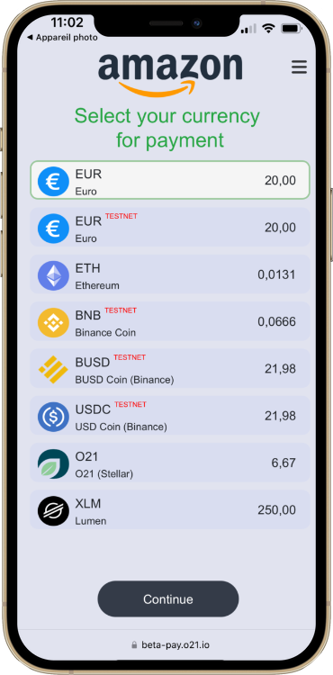
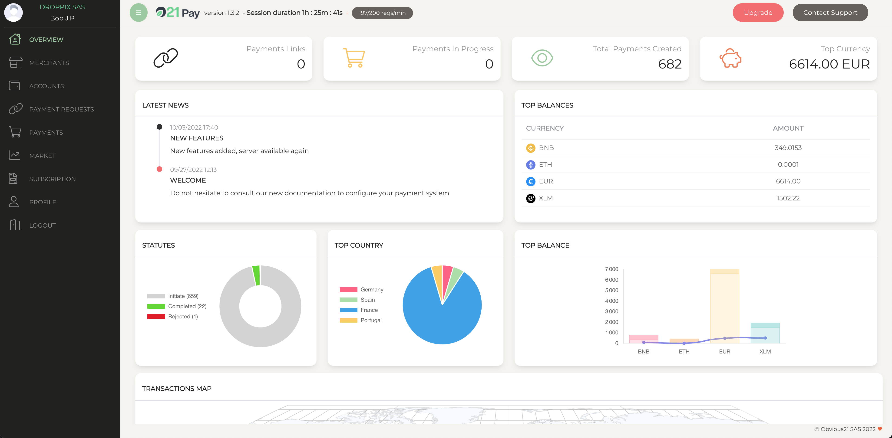
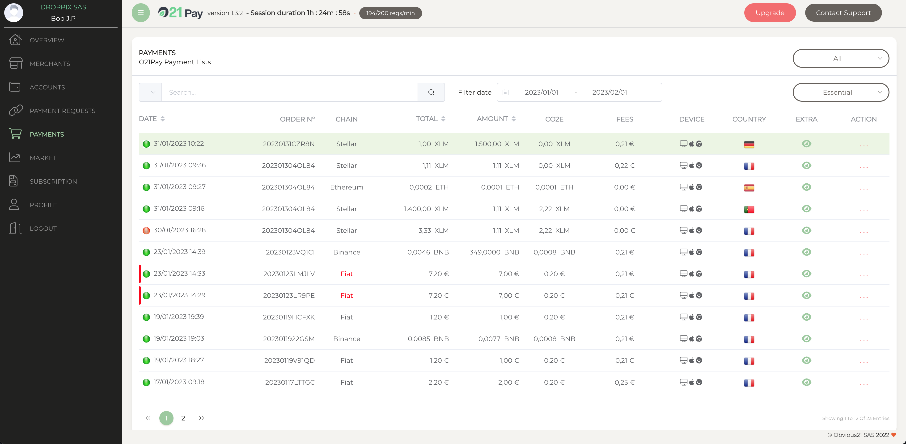
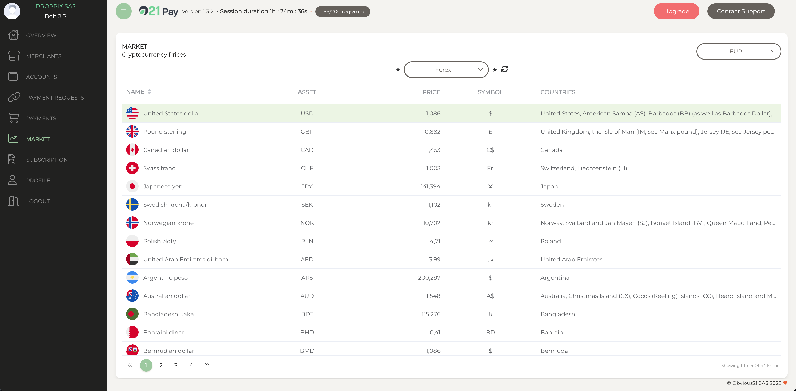
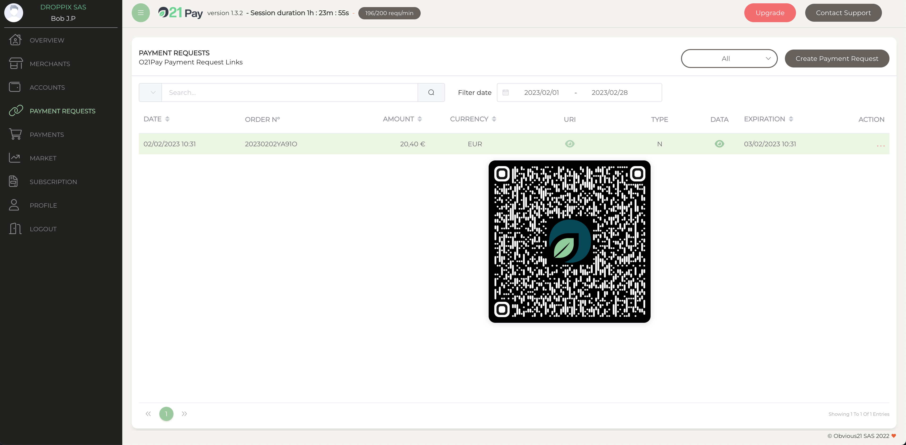
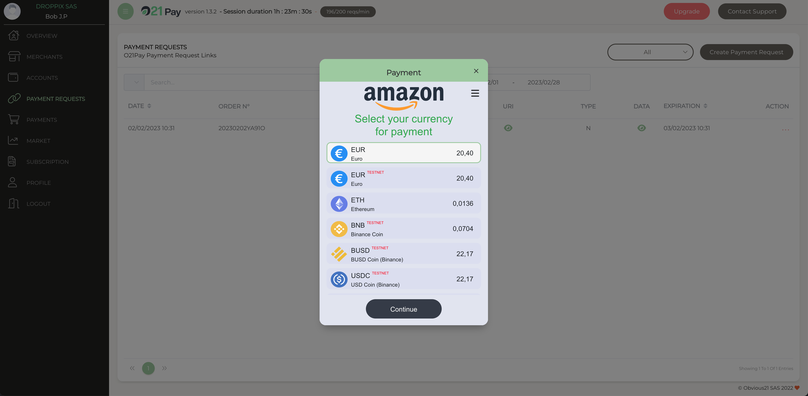

  
	        
	<h3>O21Pay-Components, Simple, Fast Payment.</h3>

 
O21Pay is an easy and secure payment service that requires no card or app to use.

Scan the QR code on the merchant site, select the currency of your choice, choose to offset your purchase and pay with your crypto wallet or banking app. It's that easy!

  
  
  
  
  
  
  

-   No risk. No credit card required, no compromise on security, no risk of default payment

-   Any time. Instant payment

-   Any device. Pay from a mobile application or website using a QR code

-   Any wallet
    We support bank accounts and crypto-currency wallets

-   Any medium. Reach a large number of customers, an audience with an appetite for cryptography and the environment.

-   No setup fees and no monthly minimums

-   Trade History. View and download your transaction history

-   Offer your customers to pay in any currency. and get paid in any currency.

-   Substainable purchase. Offer your customers to offset the CO2 emissions linked to their purchase

-   Anywhere
    Global payment access

-   Any wallet
    We support bank accounts and crypto-currency wallets

-   Any medium. Reach a large number of customers, an audience with an appetite for cryptography and the environment.

##
